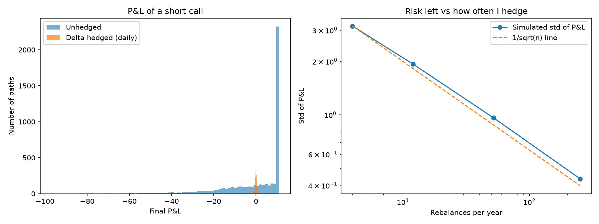

# Delta Hedging Simulation

A Monte Carlo study of how much risk delta hedging removes from a short call option, and how that changes with hedging frequency.

## Motivation
I wanted to understand how risk is managed when you sell an option. Delta hedging connects two things I studied, stochastic calculus and Black-Scholes, to a real trading problem, so I built a small simulation to test it myself.

## Method
- **Stock model:** Geometric Brownian Motion, `S(t+dt) = S(t) * exp((r - sigma^2/2) dt + sigma * sqrt(dt) * Z)`, with `Z ~ N(0, 1)`
- **Option:** European call priced with Black-Scholes; the hedge ratio is the Black-Scholes delta, `N(d1)`
- **Strategy:** sell one call and hold `delta` shares, rebalancing at fixed intervals with cash earning the risk-free rate
- **Parameters:** S0 = K = 100, sigma = 20%, r = 5%, T = 1 year, 5,000 simulated paths
- **Comparison:** no hedge vs hedging 4, 12, 52 and 252 times per year

## Results

| Strategy | Std. dev. of P&L | Risk reduction |
|---|---|---|
| Unhedged | 15.50 | - |
| Hedged 4x / year | 3.16 | 79.6% |
| Hedged 12x / year | 1.93 | 87.5% |
| Hedged 52x / year | 0.96 | 93.8% |
| Hedged 252x / year | 0.44 | 97.2% |

The mean P&L is close to zero in every case, as expected for a fairly priced option. The residual risk falls roughly in proportion to 1/sqrt(n), where n is the number of rebalances.



## How to run
```
pip install numpy scipy matplotlib
python delta_hedging.py
```
The script prints the table above and saves `hedging_results.png`.

## Limitations
- No transaction costs, which would make frequent hedging less attractive
- Constant volatility and no jumps in the stock price
- Hedging is done at discrete times only, so some gamma risk always remains